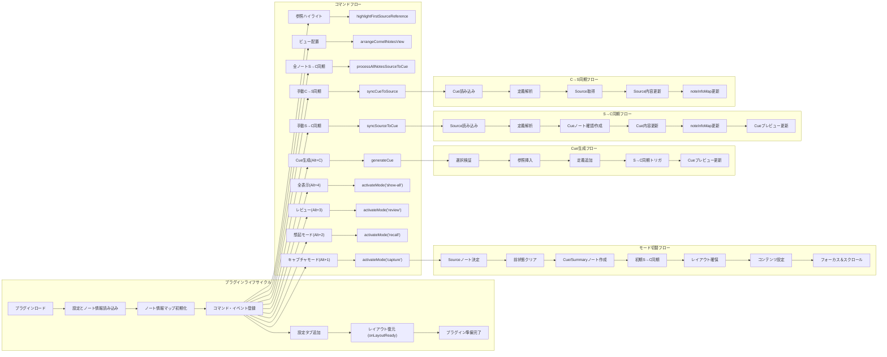

## next-cornell（私的実験／プロトタイプ派生）

> **注記**：このプラグインは、あくまで個人的な実験およびプロトタイプからの派生版です。正式な依頼案件とは関係ありません。

`next-cornell` は、従来の紙ベースのコーネル・ノート方式をそのままデジタルに持ち込むのではなく、**「フェーズごとに画面構成を切り替える」**という新たなアプローチを試みたプラグインです。

紙のノートでは固定レイアウトが有効に機能しますが、デジタル環境ではその制約がかえって柔軟性を損なう場面もあります。そこで、以下の三つのフェーズに応じて、`Cue`・`Main`・`Summary` の各セクションを動的に切り替える構成を採用しました：

### フェーズと画面構成

- **Captureモード**（Alt-1）  
  左に `Cue（Preview）`、中央に `Main（Edit）` を表示。記録フェーズにおいて、資料などの抜粋を参照しつつ、自由に書き留める構成です。

- **Recallモード**（Alt-2）  
  左に `Cue（Preview）` を表示しつつ、右に `Summary（Edit）` を展開。想起を促す「トリガー」として `Cue` を視野に入れながら、記憶を辿りつつ要点を整理・再構成します。

- **Reviewモード**（Alt-3）  
  `Main` と `Summary` を同時表示。全体を見渡しながら、要約の精度や表現を見直す段階です。

---

このプラグインは、機能性よりも「思考支援としての構成の探究」を重視した実験的なものです。機能の安定性や完成度については保証されておらず、仕様が今後大きく変更される可能性があります。興味を持ってくださった方は、動作や構造の参考としてご覧いただければ幸いです。

---

## 動作デモ
[サンプル](sample.mov)を参照してください。
