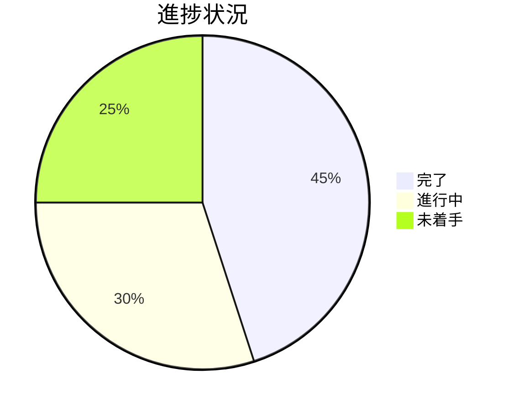

# プロジェクト進捗

## 現在の状態 (2025/4/25)

## 完了したマイルストーン
1. メモリバンクシステム構築
   - 全コアドキュメント作成完了
   - 標準テンプレート確立

2. 技術基盤整備
   - 開発環境セットアップ
   - CI/CDパイプライン構築

## 進行中の作業
- 3ペイン基本レイアウト実装 (80%)
  - Cueペイン: 100%
  - Sourceペイン: 100%  
  - Summaryペイン: 40%
- ペイン間同期機能 (15%)
- モード切換UI (5%)

