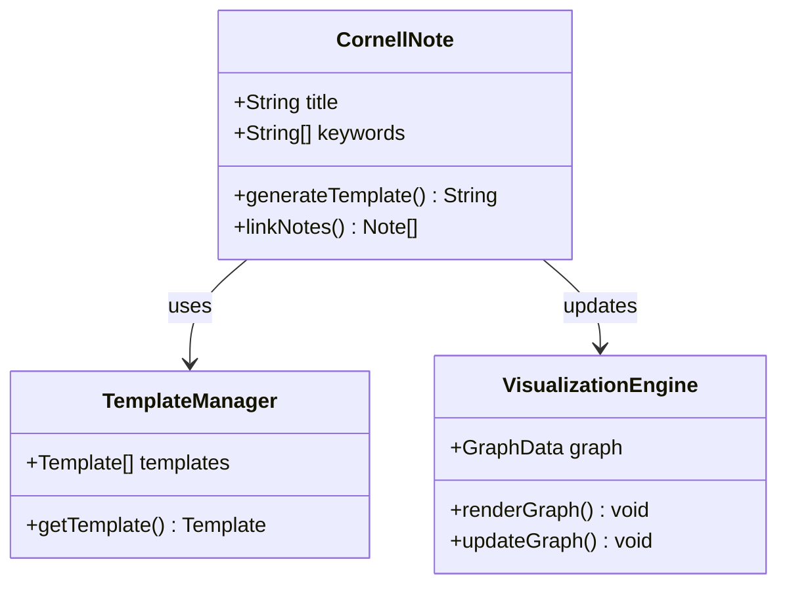

# システムパターン

## アーキテクチャ概要

## 主要設計パターン
1. **リアクティブテンプレート生成**:
   - Observerパターンによるテンプレート変更検知
   - ユーザー入力に応じた動的テンプレート調整
   - 自動同期メカニズム（debounce付き）
   - 3ペイン連動更新（Cue/Source/Summary）
   - モード別テンプレート切り替え（Capture/Recall/Review）

2. **データフロー管理**:
   - 単一方向データフロー(Fluxアーキテクチャ)
   - イミュータブルなデータ構造
   - 双方向同期（Source⇄Cue）

3. **グラフ処理**:
   - 遅延読み込み戦略
   - インクリメンタル更新アルゴリズム
   - ハイライトとナビゲーション機能

4. **プラグインアーキテクチャ**:
   - マルチペイン管理（左: Cue, 中央: Source, 右: Summary）
   - モード切換（Capture/Recall/Review/Show All）
   - 状態永続化（最後のモードとファイルを記憶）

## パフォーマンス考慮事項
- ノート読み込み: チャンク分割処理
- グラフレンダリング: WebWorker活用
- データ同期: 差分更新戦略
- 同期処理: debounceによる最適化（デフォルト1500ms）
- UI更新: バッチ処理と遅延実行
