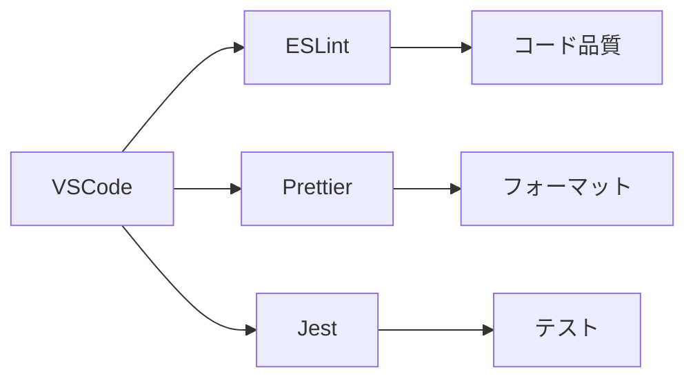

# 技術コンテキスト

## コア技術スタック
- **言語**: TypeScript 5.0+ (strictモード)
- **ランタイム**: Node.js 18+
- **フレームワーク**: Obsidian Plugin API
- **ビルドツール**: esbuild + Vite
- **同期処理**: debounce (1500ms)
- **UIライブラリ**: Obsidianのネイティブコンポーネント
- **データ永続化**: プラグイン設定+NoteInfoマップ

## 開発環境

## 主要依存関係
| パッケージ | バージョン | 用途 |
|------------|------------|------|
| obsidian   | ^1.4.0     | コアAPI |
| d3         | ^7.8.0     | グラフ可視化 |
| micromatch | ^4.0.5     | ファイルパターンマッチング |

## 開発ワークフロー
1. 機能開発: `git flow feature start`
2. テスト実行: `npm test`
3. ビルド: `npm run build`
4. デバッグ: `npm run dev`
5. リリース: `standard-version`

## 品質保証
- ユニットテストカバレッジ: 80%以上
- E2Eテスト: Playwright
- 静的解析: ESLint + TypeScriptチェック
